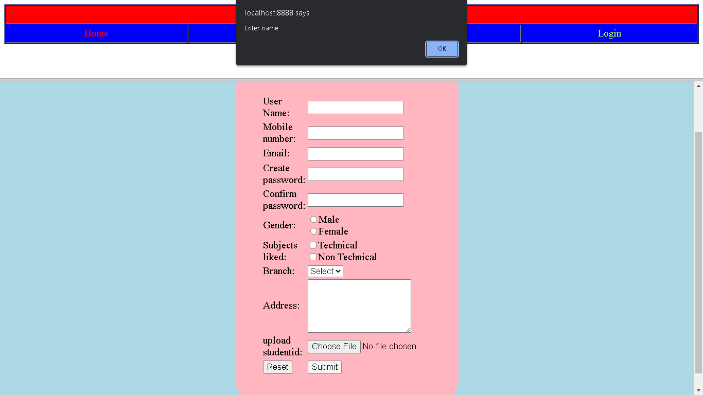
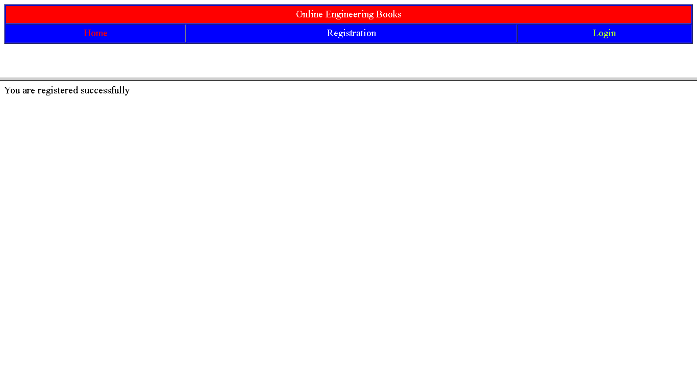
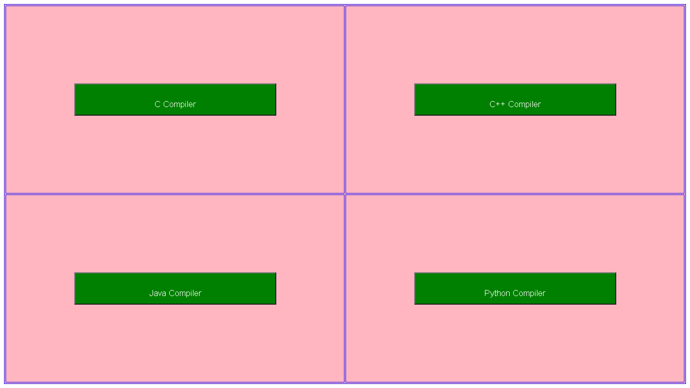

Online Engineering Books

“Online engineering books (learn to earn)” is an online based web portal which provides free access to all 8 semesters engineering books of all the main engineering streams. The students or the faculties can access this portal and get free access to the books for improving their knowledge.

Our main target is to avoid unemployment of engineering students if they have good knowledge and no arrears so that they can be placed in a good company and can contribute to the development of nation

SCREENSHOTS:

Index page

Registration page

Validation

Registered

Login page

Invalid user

Granted Access

Apache Tomcat webserver

Oracle 10g database

Engineering books

Semester 1 :

Aptitude Text Book

Engineering Calculator

Compilers

